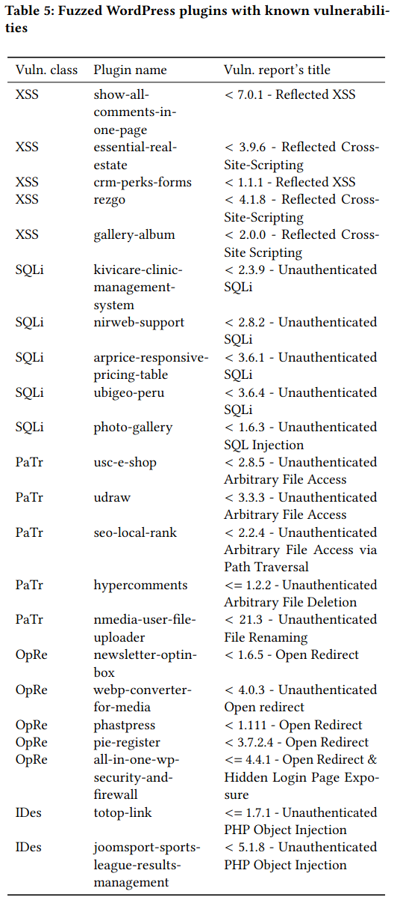

Fuzzing of Known Vulns
===========================

In this experiment, we compare PHUZZ against other vulnerability scanners (BurpSuite Pro, ZAP, WackoPicko, WFuzz) with a diverse set of web applications with known vulnerabilities.

We use the following web applications:

- bWAPP provides 30 vulnerabilities
- DVWA provides 18 vulnerabilities
- XVWA provides 10 vulnerabilities
- WackoPickko provides 7 vulnerabilities
- WordPress with 22 vulnerable plugins

For WordPress, we use the following 22 plugins, which we find using `01-scrape-wpvulndb.py` and `02-analyze_vulns.py`.

Then, we created configuration files in `../../code/fuzzer/configs/` to intialize the fuzzers with the vulnerable endpoint and the necessary parameters, while setting the vulnerable parameter(s) to the value of `fuzz`. For the blackbox scanners, we develop wrapper scripts that parse the configuration file and bring the HTTP request or command line arguments into a format understand by the respective vulnerability scanner. All scanners are given up to 300s to detect the vulnerabilities.

For each scanner and vulnerability, we initialize the database with `docker-compose up -d` and web server `docker-compose up web --force-recreate`, as well as the respective fuzzer's container.
 
See the `known-vulns.csv` for the results.