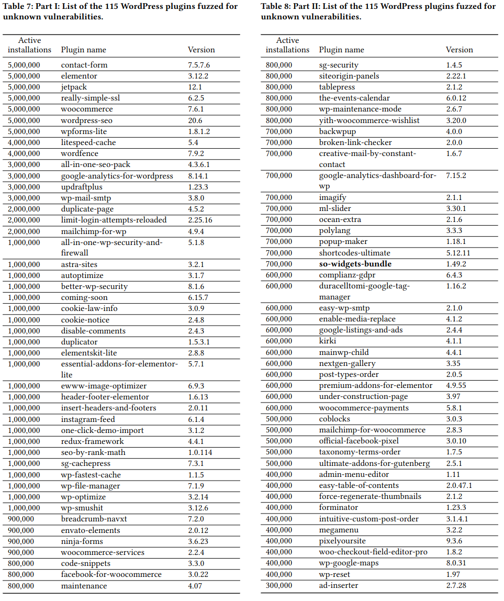
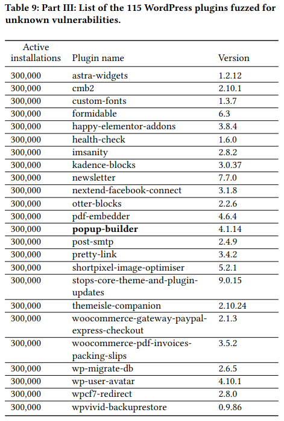

Fuzzing 0days in WordPress plugins
=========================

First, we downloaded the WordPress plugins through their API with `00-download-plugins.py`:

- Use Wordpress Plugin API to get meta data of all plugins
- Download all plugins that have `>= 300 000` active installs
- We successfully downloaded 183 plugins

To obtain the same set of plugins, execute the following commands:

```
cat plugins.tar.lrz-part-* > plugins.tar.lrz
lrzuntar plugins.tar.lrz
```

Distribution of install counts:

```
$ find . -type f -iname '*.zip' | sed 's/\.\///' | cut -d '-' -f1 | sort | uniq -c | sort -nr
     40 300000
     35 1000000
     19 400000
     18 600000
     15 700000
     13 800000
     10 5000000
      9 500000
      8 2000000
      7 900000
      6 3000000
      3 4000000
```
Sorted by install counts:
```
  300 000 => 40
  400 000 => 19
  500 000 => 9
  600 000 => 18
  700 000 => 15
  800 000 => 13
  900 000 => 7
1 000 000 => 35
2 000 000 => 8
3 000 000 => 6
4 000 000 => 3
5 000 000 => 10
```

Then we analyze the plugins with `01-analyze-all.sh` to extract the plugins' API endpoints and parameters, and generate `docker-compose.yml` files for each endpoint. 
You can define the number of instances in `01-analyze-all.py` with `N_FUZZERS=list(range(1,10+1)) #+1 to include the upper bound` and define the fuzzing timeout with `FUZZ_TIME=180`.

On our server, we first copied one of the generated configs to the parent diretory and then pre-built the other containers (`docker-compose build`). 
Then, we brought up the database with `docker-compose up -d db` in the parent directory. 
Finally, we executed `./02-fuzz-all-plugins.sh` in this directory to automatically fuzz all API endpoints with PHUZZ.
Similarly, `03-burp-all-plugins.sh` was used to fuzz the plugins with BurpSuite Pro. 

The following plugins and versions were fuzzed:





We override some of these functions to enable PHUZZ to reach more coverage coverage. See `web/applications/wordpress/_overrides/`.

| Function              | Description                                                                    | Docs                                                                     | Count in Plugins Downloaded |
| --------------------- | ------------------------------------------------------------------------------ | ------------------------------------------------------------------------ | --------------------------- |
| `check_admin_referer` | Verifies that a user was referred with the correct security nonce.             | https://developer.wordpress.org/reference/functions/check_admin_referer/ | 779                         |
| `check_ajax_referer`  | Verifies the Ajax request to prevent processing requests external of the blog. | https://developer.wordpress.org/reference/functions/check_ajax_referer/  | 1244                        |
| `current_user_can`    | Returns whether the current user has the specified capability                  | https://developer.wordpress.org/reference/functions/current_user_can/    | 4042                        |
| `get_current_user_id` | Gets the current user’s ID                                                     | https://developer.wordpress.org/reference/functions/get_current_user_id/ | 1133                        |
| `get_user_meta`       | Retrieves user meta field for a user                                           | https://developer.wordpress.org/reference/functions/get_user_meta/       | 574                         |
| `is_admin`            | Determines whether the current request is for an administrative interface page | https://developer.wordpress.org/reference/functions/is_admin/            | 1633                        |
| `is_super_admin`      | Determines whether user is a site admin                                        | https://developer.wordpress.org/reference/functions/is_super_admin/      | 280                         |
| `is_user_logged_in`   | Determines whether the current visitor is a logged in user                     | https://developer.wordpress.org/reference/functions/is_user_logged_in/   | 618                         |
| `user_can`            | Returns whether a particular user has the specified capability                 | https://developer.wordpress.org/reference/functions/user_can/            | 189                         |
| `wp_get_current_user` | Retrieves the current user object                                              | https://developer.wordpress.org/reference/functions/wp_get_current_user/ | 621                         |

The folder `vuln-analysis` contains the scripts to analyze the results and categories the vulnerabilities.

We have used `lrztar` to compress the 10GB of `phuzz-output` into `phuzz-output.tar.lrz`. You can uncompress it using `lrztar -d phuzz-output.tar.lrz`.